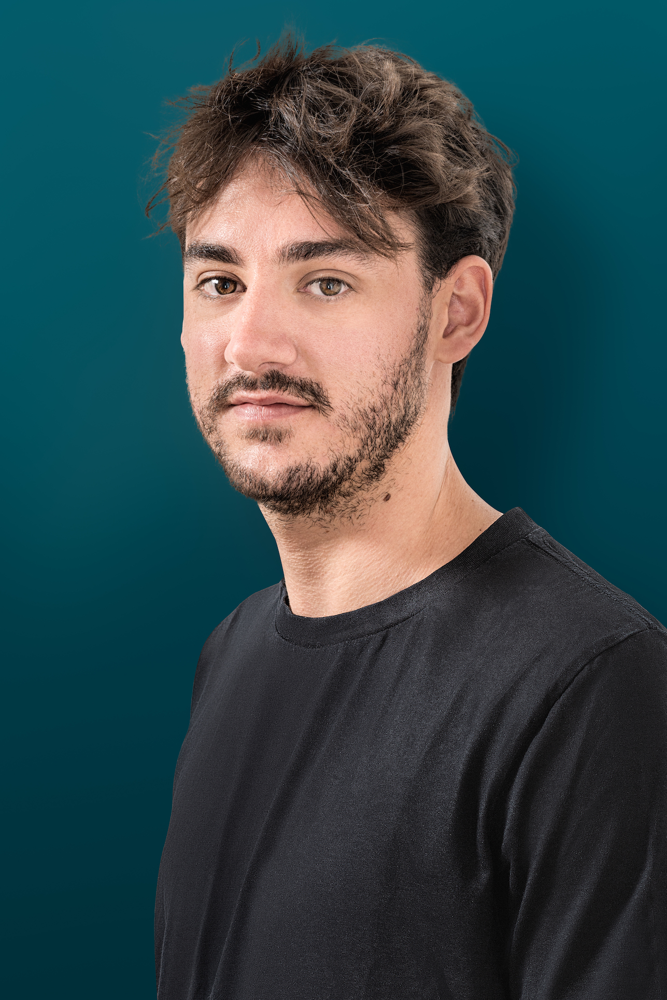

# Federico Pucci

> Computer scientist, passionate about AI, product design and complex systems.

Currently **Co-Founder & CTO** at [Daskell](https://daskell.com).

🌐 [www.puccife.com](https://www.puccife.com) &nbsp;·&nbsp; ✉️ [federico.pucci@daskell.com](mailto:federico.pucci@daskell.com)

---

### Previously

- **W/ Daskell**, Co-Founded [Voiseed](https://www.voiseed.com/) and designed the AI dubbing platform Voiseed Studio
- Data Scientist at **Swisscom**
- Data Scientist at [**bNovate**](https://www.bnovate.com/)
- Research Student at the [**EPFL Data Lab**](https://dlab.epfl.ch/) (led by Bob West)

### Education

- **MSc in Computer Science** — EPFL
- **BSc in Computer Engineering** — University of Bologna

---

$ echo "Write me an email — always happy to chat about AI, products, and hard systems."
